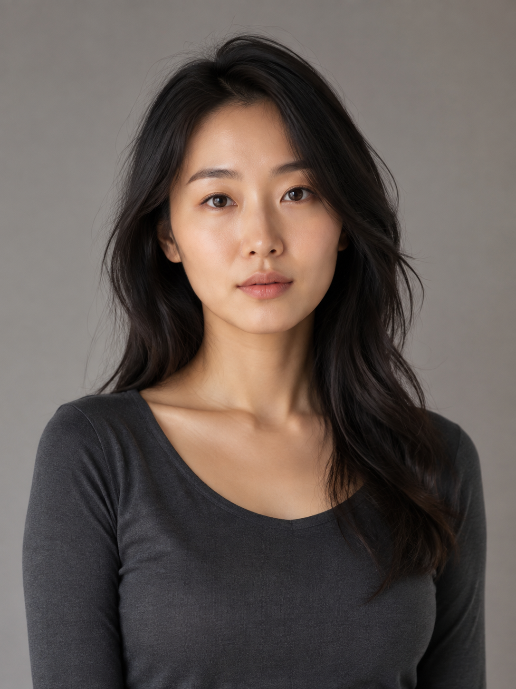
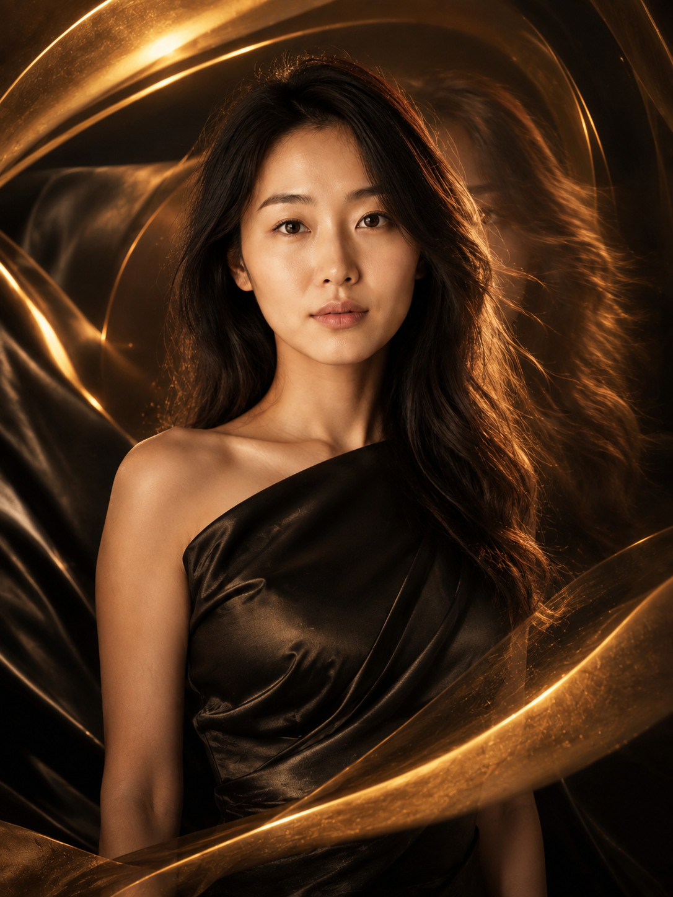
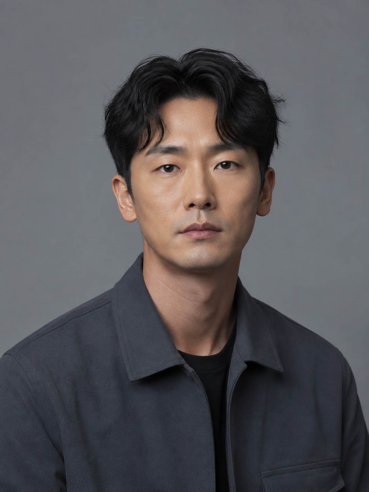
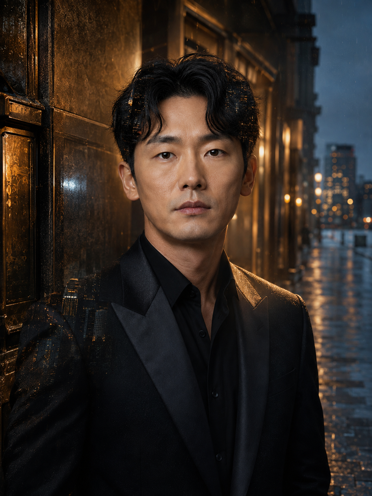

# z-cinematic-poster

Turn a portrait into a polished black-gold cinematic image in a confirmed standard or custom aspect ratio while keeping the person recognizable and naturally integrated into the design.

**Author:** zero

## What it does

- Treats facial identity as the only hard invariant while allowing a new angle, expression, gaze, pose, crop, outfit, and removable accessories.
- Retargets a tired, blank, sad, or listless expression into a natural happy, lively, approachable smile by default, changing only facial-muscle state while preserving the person's exact facial geometry and recognition cues.
- Automatically corrects underexposure, hard facial shadows, backlight, color casts, and noise with clean, even, dimensional facial relighting instead of inheriting poor source lighting.
- Applies a visible beauty-campaign finish: bright translucent rosy skin, silky continuous gradients, hydrated sheen, no recognizable pores or facial grain, and zero-residue removal of every visible red/brown spot, freckle, acne mark, pigmentation patch, tear track, and dark line, plus clearly visible makeup and polished hair without reshaping the face.
- Keeps the central face and eyes tack-sharp while restricting blur, haze, bloom, glow, and double exposure to the outer silhouette and background.
- Runs a dedicated under-eye quality check and localized retouch pass to remove tear troughs, eye bags, dark or orange-brown bands, fine creases, and rough texture without changing eye shape.
- Allows multiple private drafts, candidates, comparisons, and targeted repair passes; a first pass is never automatically final. After full quality review, it displays exactly one selected best result once—never a grid, before/after pair, alternate set, or visible retry batch.
- Asks for the output ratio before generation when none is supplied: 1:1, 3:4, 9:16, 16:9, 4:3, or custom.
- Builds a ratio-specific composition instead of stretching, padding, or cropping one fixed layout.
- Replaces ordinary clothing with refined black or black-gold editorial wardrobe unless preservation is requested.
- Builds high-detail abstract or environmental backgrounds with amber-gold light, metallic texture, haze, fine particles, and soft partial double exposure.
- Keeps the subject and background in one coherent light, perspective, color grade, and depth system.
- Generates without text, logos, or watermarks by default.

## Examples

The people shown below are fictional and were generated specifically for this repository.

| Source portrait | Abstract black-gold poster |
| --- | --- |
|  |  |

| Source portrait | Environmental black-gold poster |
| --- | --- |
|  |  |

## Requirements

- Codex with Skills support.
- An available image-generation tool that supports image references or identity-preserving edits.
- A clear portrait works best. Only use images you have permission to process.

Image fidelity, pixel dimensions, and exact likeness depend on the available image model and the quality of the source portrait. A side-facing or lowered head can be reconstructed as a front, raised, three-quarter, or profile view, but unseen facial geometry must be inferred from a single image; additional angles improve reliability. The skill treats identity drift as a failed result and requests regeneration instead of accepting it. It also requests the highest native quality supported but cannot create detail absent from a very small or heavily compressed source.

## Install

Copy or clone this repository into your Codex skills directory:

```text
~/.codex/skills/z-cinematic-poster/
```

The installed directory must contain `SKILL.md`, `agents/`, and `references/` at its top level. Restart or refresh Codex if the skill does not appear immediately.

## Use

Upload a portrait, then invoke the skill with one sentence. If no ratio is included, the skill first asks you to choose `1:1`, `3:4`, `9:16`, `16:9`, `4:3`, or a custom ratio/size, and waits before generating:

```text
Use $z-cinematic-poster to turn this portrait into a premium black-gold poster.
```

中文：

```text
用 $z-cinematic-poster，把这张人物图做成高级感黑金海报。
```

Optional details can be added naturally:

```text
Use $z-cinematic-poster with a rain-wet city at blue hour and a tailored formal outfit.
```

For a square avatar:

```text
Use $z-cinematic-poster to turn this portrait into a premium 1:1 black-gold avatar.
```

中文：

```text
用 $z-cinematic-poster，把这张人物图做成 1:1 高级感黑金头像。
```

For a custom canvas:

```text
Use $z-cinematic-poster to make this portrait as a 2:3 black-gold campaign image.
```

You do not need to repeat the identity, anatomy, lighting, double-exposure, resolution, or integration rules; they are built into the skill.

## Repository structure

```text
z-cinematic-poster/
├── SKILL.md
├── agents/openai.yaml
├── references/black-gold-campaign.md
├── examples/
└── LICENSE
```

## Safety and rights

Do not publish portraits without the subject's permission. Do not redistribute watermarked reference images, brand assets, or copyrighted photographs you do not control. Style references guide visual language only; the skill explicitly excludes copied logos, text, and watermarks from outputs.

## License

Released under the MIT License. See [LICENSE](LICENSE).

---

## 中文简介

`z-cinematic-poster` 可将人物参考图转化为高级黑金电影海报或头像。未指定比例时会先询问用户选择 1:1、3:4、9:16、16:9、4:3 或自定义比例，再按所选画布自动设计人物占比、姿态、服装、光影、柔和双曝和背景层次，同时保持人物五官与整体相貌。
